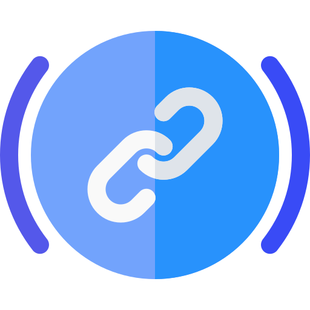

  

## Lucid - A Modern Supply Chain Solution

 A smart contract based supply-chain solution that ensures automation, transparency and security. 

 ## How does it work?

 In this supply-chain solution, we have 4 actors on the scene:
 
 1. Admin
 2. Producer
 3. Logistics
 4. Retailer

So, lets break down the role of each actor!

### Admin

Admin is responsible for approving any product that a Producer is making. Without the approval, the product cannot be shipped to the retailer.

### Producer

Producer is responsible for the production of goods. He needs to register the company first and then he can create as many as products as he wants. If the products meet the required standards, then they are approved by the Admin of the smart-contract.

### Logistics

Logistics take care of the transfer of goods from producer to the retailer. They need to get registered and then make bids fot getting the contract to ship the product.

### Retailer

Retailer recieves the products from the logistics. He also needs to be registered.

Now, as we know the roles of everyone, lets see an example!

### Supply-Chain Walkthrough

